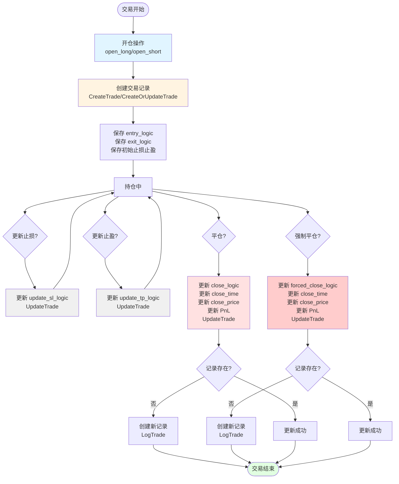

# 历史交易表生命周期更新流程图

## 交易生命周期状态图

### ASCII文本流程图（终端查看）

```
┌─────────────────────────────────────────────────────────────────┐
│                        交易开始                                  │
└────────────────────────────┬────────────────────────────────────┘
                             │
                             ▼
                    ┌─────────────────┐
                    │  开仓操作        │
                    │ open_long/short │
                    └────────┬────────┘
                             │
                             ▼
              ┌───────────────────────────────┐
              │  创建交易记录                  │
              │  CreateTrade                  │
              │  - entry_logic                │
              │  - exit_logic                 │
              │  - open_time, open_price...   │
              └───────────────┬───────────────┘
                              │
                              ▼
                    ┌─────────────────┐
                    │   持仓中        │
                    └────────┬────────┘
                             │
        ┌────────────────────┼────────────────────┐
        │                    │                    │
        ▼                    ▼                    ▼
┌───────────────┐   ┌───────────────┐   ┌───────────────┐
│  更新止损     │   │  更新止盈     │   │   平仓        │
│  update_sl    │   │  update_tp    │   │  close_*      │
└───────┬───────┘   └───────┬───────┘   └───────┬───────┘
        │                   │                    │
        ▼                   ▼                    ▼
┌───────────────┐   ┌───────────────┐   ┌───────────────┐
│UpdateTrade    │   │UpdateTrade    │   │UpdateTrade    │
│update_sl_logic│   │update_tp_logic│   │close_logic    │
└───────┬───────┘   └───────┬───────┘   │close_time     │
        │                   │            │close_price    │
        └───────────────────┴────────────┴───────────────┘
                             │
                             ▼
                    ┌─────────────────┐
                    │   持仓中        │
                    │  (可继续更新)   │
                    └────────┬────────┘
                             │
                             ▼
                    ┌─────────────────┐
                    │   强制平仓       │
                    │ forceClose      │
                    └────────┬────────┘
                             │
                             ▼
              ┌───────────────────────────────┐
              │  UpdateTrade                   │
              │  forced_close_logic            │
              │  (包含止损百分比信息)          │
              └───────────────┬───────────────┘
                              │
                              ▼
                    ┌─────────────────┐
                    │  记录存在?       │
                    └────────┬────────┘
                             │
                ┌────────────┴────────────┐
                │                         │
                ▼                         ▼
        ┌───────────────┐         ┌───────────────┐
        │  更新成功     │         │  创建新记录   │
        │  UpdateTrade  │         │  LogTrade     │
        └───────┬───────┘         └───────┬───────┘
                │                         │
                └─────────────┬───────────┘
                              │
                              ▼
                    ┌─────────────────┐
                    │   交易结束      │
                    └─────────────────┘
```

### Mermaid流程图（可视化工具查看）

可以在支持Mermaid的工具中查看（如GitHub、GitLab、VS Code等）



## 详细流程说明

### 1. 开仓阶段（Open Position）

**触发时机**：AI决策 `open_long` 或 `open_short`

**操作**：
- 调用 `executeOpenLongWithRecord` 或 `executeOpenShortWithRecord`
- 创建交易记录：`CreateTrade` 或 `CreateOrUpdateTrade`
- 保存字段：
  - `entry_logic`：进场逻辑（从 `decision.Reasoning` 提取）
  - `exit_logic`：出场逻辑（从 `decision.ExitReasoning` 提取）
  - `open_time`, `open_price`, `open_quantity`, `open_leverage` 等
  - 初始止损止盈（如果有）

**唯一键**：`(symbol, open_time)`

### 2. 更新止损阶段（Update Stop Loss）

**触发时机**：AI决策 `update_sl`

**操作**：
- 调用 `executeUpdateStopLoss`
- 更新交易记录：`UpdateTrade`
- 更新字段：
  - `update_sl_logic`：更新止损的逻辑（从 `decision.Reasoning` 获取）
  - 止损价格保存到 `position_logic` 表

**查找记录方式**：
- 使用 `getOpenTimeForPosition` 获取 `open_time`
- 使用 `(symbol, open_time)` 作为唯一键查找

**错误处理**：
- 如果记录不存在，记录警告日志（不影响主流程）

### 3. 更新止盈阶段（Update Take Profit）

**触发时机**：AI决策 `update_tp`

**操作**：
- 调用 `executeUpdateTakeProfit`
- 更新交易记录：`UpdateTrade`
- 更新字段：
  - `update_tp_logic`：更新止盈的逻辑（从 `decision.Reasoning` 获取）
  - 止盈价格保存到 `position_logic` 表

**查找记录方式**：
- 使用 `getOpenTimeForPosition` 获取 `open_time`
- 使用 `(symbol, open_time)` 作为唯一键查找

**错误处理**：
- 如果记录不存在，记录警告日志（不影响主流程）

### 4. 主动平仓阶段（Close Position）

**触发时机**：AI决策 `close_long` 或 `close_short`

**操作**：
- 调用 `executeCloseLongWithRecord` 或 `executeCloseShortWithRecord`
- 调用 `recordTradeHistory`
- 更新交易记录：`UpdateTrade`
- 更新字段：
  - `close_logic`：平仓逻辑（优先级：`decision.Reasoning` → `exit_logic` → 默认值）
  - `close_time`, `close_price`, `close_quantity`, `close_order_id`
  - `pnl`, `pnl_pct`, `duration` 等

**查找记录方式**：
- 使用 `GetOpenTradeByTime(decision.Symbol, openAction.Timestamp)` 查找
- 使用时间范围查询（±10秒）避免精确匹配失败

**错误处理**：
- 如果 `UpdateTrade` 失败（记录不存在），fallback 到 `LogTrade` 创建新记录

### 5. 强制平仓阶段（Force Close Position）

**触发时机**：
- `position_stop_loss_pct` 触发
- `position_take_profit_pct` 触发
- 账户级别风控触发

**操作**：
- 调用 `forceClosePosition`
- 调用 `recordTradeHistoryFromAction` → `recordTradeHistoryFromPosition`
- 更新交易记录：`UpdateTrade`
- 更新字段：
  - `forced_close_logic`：强制平仓逻辑（包含触发的止损百分比等信息）
  - `close_time`, `close_price`, `close_quantity`, `close_order_id`
  - `pnl`, `pnl_pct`, `duration` 等
  - `is_forced = true`, `forced_reason`

**查找记录方式**：
- 从 `positionFirstSeenTime` 或决策记录中获取 `open_time`
- 使用 `(symbol, open_time)` 作为唯一键查找

**错误处理**：
- 如果 `UpdateTrade` 失败（记录不存在），fallback 到 `LogTrade` 创建新记录

## 关键字段说明

### 逻辑字段（Logic Fields）

| 字段 | 说明 | 更新时机 |
|------|------|----------|
| `entry_logic` | 进场逻辑 | 开仓时 |
| `exit_logic` | 出场逻辑（计划） | 开仓时 |
| `update_sl_logic` | 更新止损的逻辑 | 每次 `update_sl` |
| `update_tp_logic` | 更新止盈的逻辑 | 每次 `update_tp` |
| `close_logic` | 主动平仓的逻辑 | 主动平仓时 |
| `forced_close_logic` | 强制平仓的逻辑 | 强制平仓时 |

### 平仓逻辑优先级

**主动平仓时**：
1. `decision.Reasoning`（AI直接提供的平仓理由）
2. `exit_logic`（开仓时保存的计划平仓逻辑）
3. 默认值："未提供平仓逻辑"

**强制平仓时**：
- 使用 `forced_close_logic`（包含触发原因和百分比信息）
- 不更新 `close_logic`

## 错误处理机制

### UpdateTrade 失败处理

1. **检查记录是否存在**：
   - `UpdateTrade` 现在会检查 `RowsAffected()`
   - 如果为 0，返回错误："交易记录不存在"

2. **Fallback 机制**：
   - 如果 `UpdateTrade` 失败，调用方会 fallback 到 `LogTrade`
   - 创建新记录（向后兼容）

3. **时间匹配问题**：
   - 使用 `GetOpenTradeByTime` 进行时间范围查询（±10秒）
   - 避免精确时间匹配失败

## 数据一致性保证

1. **唯一键约束**：`(symbol, open_time)` 确保不会重复创建
2. **生命周期维护**：从开仓到平仓，整个生命周期都在维护同一笔记录
3. **错误恢复**：如果更新失败，会创建新记录确保数据不丢失

